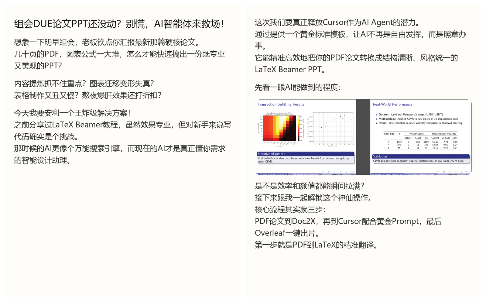
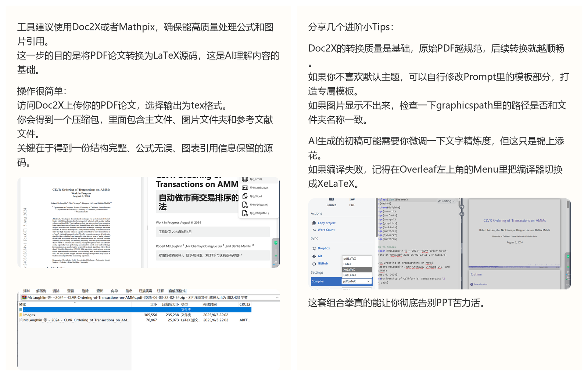

# rednote-content-studio

把 Markdown 一键转换为可发布的 REDnote 图文卡片，并把“最后一公里定稿权”交回给你。

> GitHub: https://github.com/bluesHeart/rednote-content-studio
>
> 如果这个项目对你有帮助，欢迎先点个 **Star** ⭐

---

## 你能得到什么

- **可控生成**：不是一次性改写，支持块级编辑、锁定、局部重写
- **图文对齐**：图片跟随正文流，不再乱序/堆顶
- **双入口**：CLI 批处理 + Web 可视化操作
- **完整产物**：`txt/html/png/json`

---

## 效果示例





实战文章（含截图）：`docs/showcase/cases/rednote_final_mile_story.md`

---

## 快速开始

### 1) 安装依赖

```bash
pip install -r requirements.txt
```

### 2) 配置模型

最少设置一个 Key：

- `SKILL_LLM_API_KEY`（或 `OPENAI_API_KEY`）

可选：

- `SKILL_LLM_BASE_URL`（默认 `https://api.openai.com/v1`）
- `SKILL_LLM_MODEL`（默认 `gpt-4o-mini`）

### 3) 运行

CLI：

```bash
python scripts/main.py examples/test_input.md --output ./output
```

Web：

```bash
python app.py --port 8000
```

访问：`http://127.0.0.1:8000`

---

## 必需与可选文件

请看：`docs/guide/required-files.md`

结论：`SKILL.md`（现位于 `docs/guide/ai-assistant-skill.md`）**不是运行必需文件**，仅供 AI 助手场景使用。

---

## 开源协议

- License: `MIT`（见 `LICENSE`）
- Repo: Public

---

## 共建

- Issue: https://github.com/bluesHeart/rednote-content-studio/issues
- PR: 欢迎直接提交

